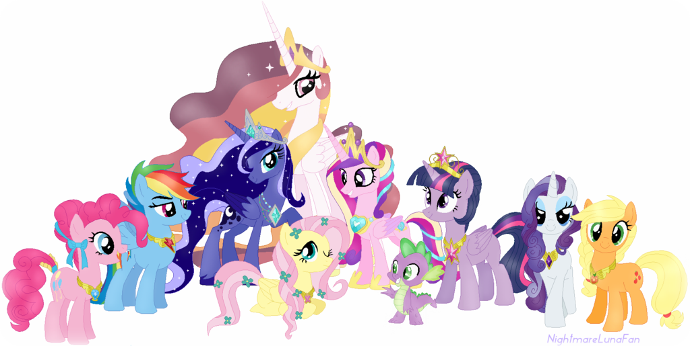

=============
Core concepts
=============

Flow
====

Viewflow adds the addional layer to the standard djagno Model-View-Template trio.

The :doc:`viewflow_core_flow` Layer is responsible to manage inner-task dependencies,
allows extract flow logic out of View, leave in them only CRUD
functionality.

.. image:: _static/ViewflowCore.png
   :class: responsive-img

Each :doc:`attribute <viewflow_core_node>` of the flow represents a flow task or gateway. Task
could be a human action, syncronoius or asynchronius python job or
even handler. Gateway is a non-interactive node that decide what tasks
should be activated next.

To connect flow task altogether the special :doc:`this
<viewflow_core_this>` object can be used to make references
to flow nodes or flow methods before they declared.

.. code-block:: python

    from viewflow import flow
    from viewflow.base import this, Flow

    class SampleFlow(Flow):
        start = flow.Start(my_view).Next(this.task)

        task = flow.Handler(perform_task).Next(this.check_status)

        check_status = flow.If(this.is_completed) \
            .Then(this.end).Else(this.task)

        end = flow.End()

        def perform_task(self, activation):
             activation.process.completed = random.randint(0, 1)

        def is_completed(self, activation):
            retun activation.process.completed
        
At runtime each node represented as a task :doc:`activation
<viewflow_core_activation>` instance. Activation instance are
responsible for precondition check, task and process state transition
management, and next tasks instantiation. Each flow node could have
own activation implementation, with any interface as you like. All
build-in activations are very similar, ex, you can expect that all
activations have methods `.cancel()`, `.undo()`, that cancels an
active task, and revert completed respectivly.

.. code-block:: python

    @flow.flow_view
    def cancel_task_view(request, **kwargs):
        if not activation.cancel.can_proceed():
             returun redirect('index')

        if request.method == 'POST':
             activation.cancel()
             returun redirect('index')

        return render(request, 'cancel_task.html')

Database
========

In a database, state of the flows stored in the two Process/Task
:doc:`models <viewflow_core_models>`, task and process states are
managed by tasks activation classes

.. image:: _static/Models.png
   :class: responsive-img

Locking
=======

To avoid concurent flow updates viewflow can use short-time
pessimistic :doc:`locking <viewflow_core_locking>` on a process
instance. Entire view and handler's code is exucuted under lock. For
the background jobs, lock asqured only at the start and at the end of
a job.

Locking is not enabled by default. You need to choose proper lock
implementation and enable it.

.. code-block:: python

    from viewflow import lock

    class SampleFlow(Flow):
        lock_impl = lock.select_for_update_lock

Views
=====

Viewflow core is independed from a specific view implementation. With
viewflow you can use as class-based views as functional based
views. :doc:`viewflow.flow <viewflow_flow>` package provides standard
django template based views, :doc:`viewflow.rest <viewflow_rest>` is
the reference rest implementation.

Each viewflow view expects to get `flow_task` and `flow_class` from
the url confing. Task views also expects that `process_pk` and
`task_pk` are present in the url.

To get an a activation in a view, you can use one of :doc:`decorators
<viewflow_core_decorators>` shortcuts that would proceed url
parameters, set the lock and instantiate process, task and activation
instances.

.. image:: _static/ViewflowView.png
   :class: responsive-img

URLs
====

`Flow.urls` contains all views and task actions urls and can be used
directly in the url config. `viewflow.flow.viewset.FlowViewset` and
`viewflow.rest.viewt.FlowViewset` builds a url config that contains
list views (ex: inbox) in addition. If you use the viewflow frontend,
no specific url configuration is required.

.. code-block:: python

    ulrpatterns = [
        url(r'^sampleflow/', SampleFlow.instance.urls)
    ]

or, with build-in list views:

.. code-block:: python

    from viewflow.flow.viewset import FlowViewSet
    
    ulrpatterns = [
        url(r'^sampleflow/', FlowViewSet(SampleFlow).urls)
    ]

or, in case of viewflow frontend

.. code-block:: python

   from material.frontend import urls as frontend_urls

    urlpatterns = [
        url(r'', include(frontend_urls)),
    ]

Error handing
=============

Viewflow provides two different strategies for an :doc:`error
handing <viewflow_core_exceptions>`. For view tasks any exception
in subsequent task activation would rollback the whole transaction,
and view task will be available for end user again, for the case if
they can change input data to pass.For the jobs, jobs result committed
as soon as job ends. If error happens in subsequent task, subsequent
task will be saved in error state and available for administrator for
further processing in django admin. Error handling strategy could be
customized in activation class.

.. image:: _static/ViewflowError.png
   :class: responsive-img

Flow migration
==============

Viewflow keeps only task names in the database. No action required to
add new task or change task connections.

To rename the task, you can create a django data migration, with simple SQL Update statement

.. code-block:: python
    
    migrations.RunSQL("""
        UPDATE viewflow_task SET flow_task='helloworld/flows.MyFlow.new_name'
        WHERE flow_task='helloworld/flows.MyFlow.old_name'
    """)

If you would like to delete a task from flow definition, but leave
database without changes, you can add a special :class:`Obsolete <viewflow.flow.obsolete.Obsolete>` node to
your flow.  Obsolete node will provide a view to see the historical
task state, and ability to admins to cancel active obsolete tasks. No
database content changes is also required.

.. code-block:: python

    from viewflow import flow

    class SampleFlow(Flow):
        obsolete = flow.Obsolete()

Viewflow frontend
=================

Viewflow frontend speeds up flow UI development as quickly as django
admin does for the CRUD. Frontend provide ready you use html/css theme
based on material design, and flow list and action views. In order to
start using it, you need only :doc:`turn it on <viewflow_frontend>`
and register a flow.

.. code-block:: python

    from viewflow import frontend

    @frontend.register
    class SampleFlow(Flow):
        ...

Further Options
===============

Any web project with viewflow library, is still the django project,
you can use any `reusable app <http://djangopackages.com>`_ available
for the django web framework or any `Python Library
<https://github.com/vinta/awesome-python>`_

        
Table of Contents
=================

.. toctree::
   :maxdepth: 2
   :titlesonly:

   viewflow_core_flow
   viewflow_core_node
   viewflow_core_this
   viewflow_core_activation
   viewflow_core_models
   viewflow_core_decorators
   viewflow_core_locks
   viewflow_core_exceptions
   viewflow_core_signals
