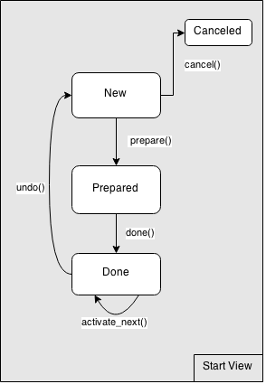
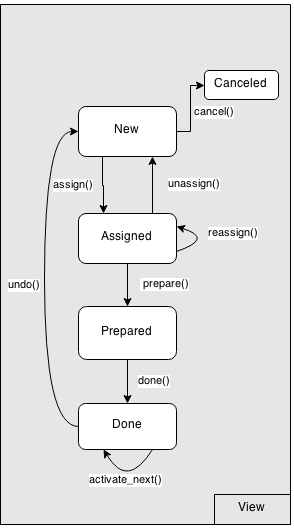
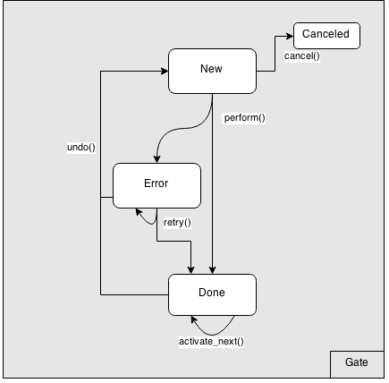
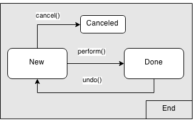

====
Flow
====

.. autoclass:: viewflow.base.Flow
      :members:

Nodes
=====

.. autoclass:: viewflow.flow.base.Node
      :members:

Start View
==========

.. autofunction:: viewflow.flow.start_view.flow_start_view

.. autoclass:: viewflow.flow.start_view.ManagedStartViewActivation
      :members:

.. autoclass:: viewflow.flow.start_view.BaseStart
      :members:

.. autoclass:: viewflow.flow.start_view.Start
      :members:

Task View
=========

.. autofunction:: viewflow.flow.task_view.flow_view

.. autoclass:: viewflow.flow.task_view.ManagedViewActivation
      :members:

.. autoclass:: viewflow.flow.task_view.BaseView
      :members:

.. autoclass:: viewflow.flow.task_view.View
      :members:

Function tasks
==============

.. autoclass:: viewflow.flow.func.StartFunction
      :members:

.. autoclass:: viewflow.flow.func.FuncActivation
      :members:

.. autoclass:: viewflow.flow.func.FlowFunc
      :members:

.. autofunction:: viewflow.flow.func.flow_func

.. autoclass:: viewflow.flow.func.Function
      :members:

.. autoclass:: viewflow.flow.func.HandlerActivation
      :members:

.. autoclass:: viewflow.flow.func.Handler
      :members:

Signals tasks
=============

.. autoclass:: viewflow.flow.signal.StartSignal
      :members:

.. autoclass:: viewflow.flow.signal.Receiver
      :members:

.. autofunction:: viewflow.flow.signal.flow_signal

.. autoclass:: viewflow.flow.signal.Signal
      :members:

Gates
=====

.. autoclass:: viewflow.flow.gates.IfActivation
      :members:

.. autoclass:: viewflow.flow.gates.If
      :members:

.. autoclass:: viewflow.flow.gates.SwitchActivation
      :members:

.. autoclass:: viewflow.flow.gates.Switch
      :members:

.. autoclass:: viewflow.flow.gates.JoinActivation
      :members:

.. autoclass:: viewflow.flow.gates.Join
      :members:

.. autoclass:: viewflow.flow.gates.SplitActivation
      :members:

.. autoclass:: viewflow.flow.gates.Split
      :members:

End
===

.. autoclass:: viewflow.flow.end.End
      :members:

